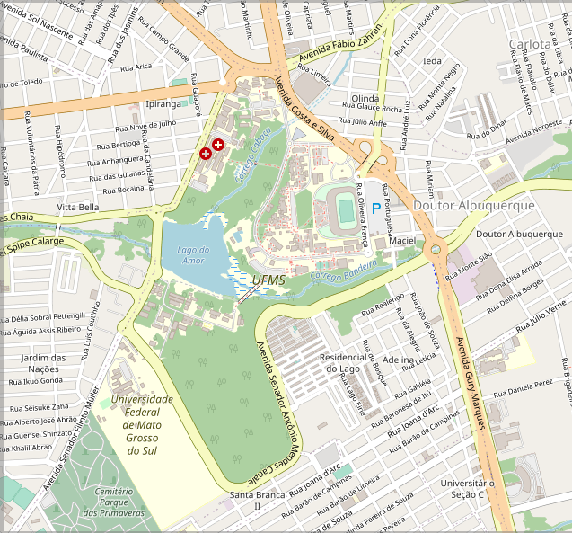

# Hadoop-simulation-urban-modbility

<a href="https://sumo.dlr.de/docs"><p align="center"></p></a>

[SUMO - Simulation of Urban MObility](https://github.com/eclipse/sumo), é um "pacote" de simulação de tráfego multimodal
contínuo, microscópico e de código aberto, projetado para lidar com grandes redes.

Nesse repositório tem como objetivo de demonstrar a utilização do Hadoop, Sumo e Python através da resolução do problema
de contabilizar a quantidade de gases emitidos na simulação, calculando a emissão de gases de acordo com o tipo de veículo das
regiões próximas aos redores da Universidade Federal do Mato Grosso do Sul - UFMS. O script mapper.python está mapeando
o conjunto de dados necessários para realizar os cálculos que a demonstração propõe, que são:

- `timestep_time(seconds)`: O intervalo de tempo descrito pelos valores neste elemento timestep
- `vehicle_CO(mg/s)`: CO emitido pelo veículo
- `vehicle_CO2(mg/s)`: A quantidade de CO2 emitida pelo veículo
- `vehicle_HC(mg/s)`: A quantidade de HC emitida pelo veículo
- `vehicle_NOx(mg/s)`: A quantidade de NOX emitida pelo veículo
- `vehicle_PMx(mg/s)`: A quantidade de PMX emitida pelo veículo
- `vehicle_electricity(Wh/s)`: A quantidade de eletricidade usada pelo veículo
- `vehicle_fuel(ml/s)`:A quantidade de combustível usado pelo veículo na etapa
- `vehicle_noise(dB)`: O ruído emitido pelo veículo
- `vehicle_speed(m/s)`: A velocidade do veículo
- `vehicle_type`: Tipo do veiculo

O script reducer.py está sumarizando os dados coletados pelo mapper, calculando a média de cada tipo de dado, rastreando
o menor e maior valor. Após a execução é mostrado esses dados no formato csv. Segue o exemplo:

```text 
bus_bus;808584.1700001246;413559791.52013135;174305.4800000484;3463388.2899999847;84502.41999999958;0.0;176324.249999999;2105283.890000661;160128.71999999968;56.86;42895.3;9.71;315.42;6.14;0.0;18.29;80.96;13.89;20.17;5286.11;4.85;60.75;2.01;0.0;2.25;67.11;0.0;27.798816309695898;14218.028381068221;5.992556124730925;119.06997249630366;2.905161068518568;0.0;6.061960669714959;72.37885962803523;5.505164506480547
moto_motorcycle;2118456.10999982;47577558.09999812;9061.580000000788;10372.730000000767;2949.410000000236;0.0;20460.41000000116;653119.2099999784;69551.01999999999;1103.06;42895.3;9.71;315.42;6.14;0.0;18.29;88.58;17.11;0.25;1228.61;0.07;0.31;0.03;0.0;0.53;55.94;0.0;53.90747900656064;1210.6865005852235;0.23058628937861436;0.2639505827268758;0.07505241997048796;0.0;0.5206476156547702;16.619655198737302;1.7698361239757745
truck_truck;1347404.5999993284;903173699.0794009;0.0;8127264.65999625;170375.77000002592;0.0;382917.4800000789;3820275.619999085;308433.3199999985;1103.06;53402.58;9.71;425.94;7.36;0.0;22.64;88.58;17.11;0.25;1228.61;0.0;0.31;0.03;0.0;0.53;55.94;0.0;14.67345414152123;9835.707741591716;0.0;88.5072273647578;1.8554197068371259;0.0;4.170033323896052;41.60341972860721;3.3588887678870742
veh_passenger;7813112.380001801;266032205.3199703;41759.82000000403;111982.98999993764;5267.010000001414;0.0;114398.60000004305;4322276.179998719;415227.17000000575;1103.06;53402.58;9.71;425.94;7.36;0.0;22.64;88.58;18.05;0.01;1228.61;0.0;0.31;0.01;0.0;0.53;55.94;0.0;48.26901498771701;1643.5335729552241;0.2579900658569683;0.6918252752272721;0.03253932264960779;0.0;0.706748792211107;26.70280466557967;2.5652525545822207
``` 

Segue a leitura desses dados na forma de tabela:

|'vehicle_name' |vehicle_CO'       |'vehicle_CO2'     |'vehicle_HC'     |'vehicle_NOx'     |'vehicle_PMx'     |'vehicle_electricity'|'vehicle_fuel'    |'vehicle_noise'  |'vehicle_speed'   |'vehicle_CO_max'|'vehicle_CO2_max'|'vehicle_HC_max'|'vehicle_NOx_max'|'vehicle_PMx_max'|'vehicle_electricity_max'|'vehicle_fuel_max'|'vehicle_noise_max'|'vehicle_speed_max'|'vehicle_CO_min'|'vehicle_CO2_min'|'vehicle_HC_min'|'vehicle_NOx_min'|'vehicle_PMx_min'|'vehicle_electricity_min'|'vehicle_fuel_min'|'vehicle_noise_min'|'vehicle_speed_min'|'vehicle_CO_mean' |'vehicle_CO2_mean'|'vehicle_HC_mean'  |'vehicle_NOx_mean'|'vehicle_PMx_mean' |'vehicle_electricity_mean'|'vehicle_fuel_mean'|'vehicle_noise_mean'|'vehicle_speed_mean'|
|---------------|------------------|------------------|-----------------|------------------|------------------|---------------------|------------------|-----------------|------------------|----------------|-----------------|----------------|-----------------|-----------------|-------------------------|------------------|-------------------|-------------------|----------------|-----------------|----------------|-----------------|-----------------|-------------------------|------------------|-------------------|-------------------|------------------|------------------|-------------------|------------------|-------------------|--------------------------|-------------------|--------------------|--------------------|
|bus_bus        |808584.1700001246 |413559791.52013135|174305.4800000484|3463388.2899999847|84502.41999999958 |0.0                  |176324.249999999  |2105283.890000661|160128.71999999968|56.86           |42895.3          |9.71            |315.42           |6.14             |0.0                      |18.29             |80.96              |13.89              |20.17           |5286.11          |4.85            |60.75            |2.01             |0.0                      |2.25              |67.11              |0.0                |27.798816309695898|14218.028381068221|5.992556124730925  |119.06997249630366|2.905161068518568  |0.0                       |6.061960669714959  |72.37885962803523   |5.505164506480547   |
|moto_motorcycle|2118456.10999982  |47577558.09999812 |9061.580000000788|10372.730000000767|2949.410000000236 |0.0                  |20460.41000000116 |653119.2099999784|69551.01999999999 |1103.06         |42895.3          |9.71            |315.42           |6.14             |0.0                      |18.29             |88.58              |17.11              |0.25            |1228.61          |0.07            |0.31             |0.03             |0.0                      |0.53              |55.94              |0.0                |53.90747900656064 |1210.6865005852235|0.23058628937861436|0.2639505827268758|0.07505241997048796|0.0                       |0.5206476156547702 |16.619655198737302  |1.7698361239757745  |
|truck_truck    |1347404.5999993284|903173699.0794009 |0.0              |8127264.65999625  |170375.77000002592|0.0                  |382917.4800000789 |3820275.619999085|308433.3199999985 |1103.06         |53402.58         |9.71            |425.94           |7.36             |0.0                      |22.64             |88.58              |17.11              |0.25            |1228.61          |0.0             |0.31             |0.03             |0.0                      |0.53              |55.94              |0.0                |14.67345414152123 |9835.707741591716 |0.0                |88.5072273647578  |1.8554197068371259 |0.0                       |4.170033323896052  |41.60341972860721   |3.3588887678870742  |
|veh_passenger  |7813112.380001801 |266032205.3199703 |41759.82000000403|111982.98999993764|5267.010000001414 |0.0                  |114398.60000004305|4322276.179998719|415227.17000000575|1103.06         |53402.58         |9.71            |425.94           |7.36             |0.0                      |22.64             |88.58              |18.05              |0.01            |1228.61          |0.0             |0.31             |0.01             |0.0                      |0.53              |55.94              |0.0                |48.26901498771701 |1643.5335729552241|0.2579900658569683 |0.6918252752272721|0.03253932264960779|0.0                       |0.706748792211107  |26.70280466557967   |2.5652525545822207  |

## Dataset

A simulação foi criada utilizando as ruas e avenidas encontradas perto da [UFMS](https://www.ufms.br/). Segue a imagem:


O dataset contém as seguintes entidades: carros, caminhões, ônibus, motocicleta, bicicleta e pedestre. As rodas foram
gerados aleatoriamento. Segue mais dados da simulação maxima

```text
Simulation ended at time: 2864.00
Reason: All vehicles have left the simulation.
Performance: 
 Duration: 23.95s
 Real time factor: 119.577
 UPS: 14051.605361
 UPS-Persons: 14261.575717
Vehicles: 
 Inserted: 800
 Running: 0
 Waiting: 0
Teleports: 8 (Jam: 5, Yield: 3)
Persons: 
 Inserted: 247
 Running: 0
 Jammed: 5
Statistics (avg):
 RouteLength: 2507.09
 Speed: 7.41
 Duration: 420.69
 WaitingTime: 95.09
 TimeLoss: 188.33
 DepartDelay: 0.84
Pedestrian Statistics (avg of 247 walks):
 RouteLength: 1659.22
 Duration: 1382.91
 TimeLoss: 173.69
```

## Executar o ambiente

O ambiente pode ser executado utilizando o [laboratorio na Google Cloud](https://github.com/DiegoBulhoes/lab-hadoop) ou
localmente com o [Docker](https://www.docker.com/). Segue o exemplo de um container já
configurado `https://github.com/DiegoBulhoes/Docker-hadoop`

- Crie um hdfs

```shell  
$HADOOP_HOME/bin/hdfs namenode -format  
```  

- Start todos os serviços

```shell  
/opt/hadoop/sbin/start-all.sh  
```  

- Criar um diretório no HDFS para armazenar alguns arquivos

```shell  
$HADOOP_HOME/bin/hdfs dfs -mkdir /user  
```  

```shell  
$HADOOP_HOME/bin/hdfs dfs -mkdir /user/hadoop  
```  

- Realizar o upload da lista de modelos de carros

```shell  
$HADOOP_HOME/bin/hdfs dfs -put /home/hadoop/input /user/hadoop  
```  

Para exibir a lista basta executar o seguinte comando:

```shell  
$HADOOP_HOME/bin/hdfs dfs -cat emission.csv 
```  

- Para realizar o job de mapper e reducer execute a seguinte comando:

```shell  
$HADOOP_HOME/bin/mapred streaming -files mapper.py,reducer.py -mapper mapper.py -reducer reducer.py -input /user/hadoop/emission.csv -output /user/hadoop/output  
```  

- Para realizar o download da saída do Mapreduce

```shell  
$HADOOP_HOME/bin/hdfs dfs -get /user/hadoop/output  

```
## graficos
### sobre os gases e rudio
<a href="https://sumo.dlr.de/docs"></p></a>
<a href="https://sumo.dlr.de/docs"></p></a>
<a href="https://sumo.dlr.de/docs"></p></a>
<a href="https://sumo.dlr.de/docs"></p></a>
<a href="https://sumo.dlr.de/docs"></p></a>
<a href="https://sumo.dlr.de/docs"></p></a>

### Max, min, mean.
<a href="https://sumo.dlr.de/docs"></p></a>
<a href="https://sumo.dlr.de/docs"></p></a>
<a href="https://sumo.dlr.de/docs"></p></a>

### Referencias:

- [Hadoop with Python](https://www.oreilly.com/library/view/hadoop-with-python/9781492048435/)
- [Simulation of Urban MObility](https://www.eclipse.org/sumo/) 
 
